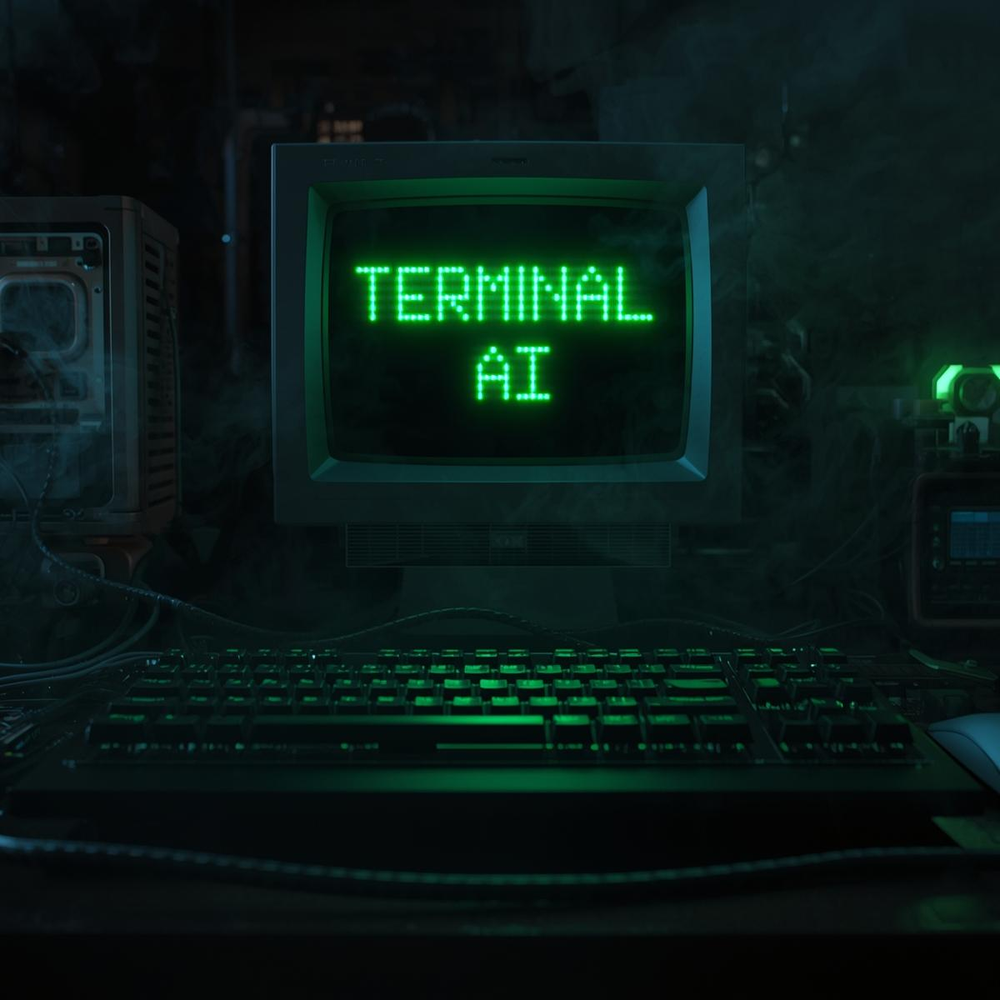

# 🤖 TERMINAL AI (Official)

> **🏆 Officially Listed in Warden Protocol Community Agents**
> **Your All-in-One Autonomous Crypto Agent on Base 🔵**
> *Powered by Warden Protocol & LangGraph*



**Terminal AI** is a professional-grade autonomous agent built for the **Warden Agent Hub**. It cuts through the market noise to provide real-time forensics, risk analysis, and trading insights exclusively for the Base network.

Built with **LangGraph** and the **Warden Agent Kit**, it represents the next generation of "vibe coding" — robust, secure, and incredibly fast.

---

## ✨ Why Terminal AI?

Unlike simple chatbots, Terminal AI is a **Forensic Tool**. It doesn't just read prices; it analyzes on-chain behavior.

*   **🛡️ Security First:** Instant `Risk Analysis` scans contracts for honeypots and rug pulls before you trade.
*   **🐋 Whale Watch:** Live monitoring of large transactions (>$500). See what the "smart money" is doing in real-time.
*   **⚡ Speed:** Optimized for the Base L2 network — cheap gas, fast data, instant insights.
*   **🌉 Onboarding:** Direct access to the best bridges (Relay, Jumper, deBridge) to get funds onto Base in seconds.

---

## 🚀 Features & Commands

Interact with Terminal AI using natural language or these specific commands:

| Feature | Command / Trigger | Description |
| :--- | :--- | :--- |
| **🔥 Market Trends** | `Trend` / `Hot` | Shows top trending tokens on Base live. |
| **📈 Live Charts** | `Chart <token>` | **New:** Live ASCII price charts (ETH, BTC, SOL & Base). |
| **🚀 Top Gainers** | `Gainers` / `Top` | Lists the biggest 24h movers. |
| **🛡️ Risk Scanner** | `Risk <token>` | Performs a security audit (Honeypot, liquidity, verified contract). |
| **🐋 Whale Watch** | `Whale <token>` | **Killer Feature:** Tracks live large buy/sell orders (>$500). |
| **💰 Portfolio** | `DeBank <address>` | Full multi-chain wallet analysis via DeBank. |
| **⛽ Gas Station** | `Gas` | Real-time Base gas fees & swap cost estimates. |
| **🌾 Yield Search** | `Yield` | Finds the best APY farming pools on Base. |
| **🌐 Warden Info** | `Menu` | Official Warden Protocol resources (Discord, Link3). |
| **🌉 Bridge** | `Bridge` | Links to top bridges (Relay, Jumper, deBridge). |
| **🎁 Airdrops** | `Airdrops` | Link to potential airdrop dashboards & tasks. |

---

## 🛠️ Tech Stack (Warden Compliant)

Terminal AI is built strictly adhering to the **Warden Protocol** standards for the Agent Developer Incentive Program.

*   **Orchestration:** [LangGraph](https://langchain-ai.github.io/langgraph/) (Stateful, multi-turn agent logic)
*   **Blockchain SDK:** `@wardenprotocol/warden-agent-kit-core`
*   **LLM Integration:** `@wardenprotocol/warden-langchain`
*   **Network:** Base (EVM)

---

## ⚡ Getting Started

### Prerequisites
*   Node.js (v18+)
*   A Warden Agent Wallet Private Key (EVM)
*   OpenAI API Key

### Installation

1.  **Clone the Repository**
    ```bash
    git clone https://github.com/ogeth777/TERMINALAI.git
    cd warden-bot
    ```

2.  **Install Dependencies**
    ```bash
    npm install
    ```

3.  **Configure Environment**
    Create a `.env` file in the root directory:
    ```env
    OPENAI_API_KEY=sk-your-key-here
    PRIVATE_KEY=0x... (Your Agent's Wallet Private Key)
    ```

4.  **Run the Agent**
    ```bash
    npm run dev
    ```

---

## 🔮 Future Roadmap

*   **Autonomous Swaps:** Agent-driven trading execution (Coming Soon).
*   **Multi-Chain Support:** Expanding forensics to Arbitrum and Solana.
*   **Automated Alerts:** Push notifications for whale movements.

---

## 📄 License

MIT License. Built for the Warden Protocol Community.
